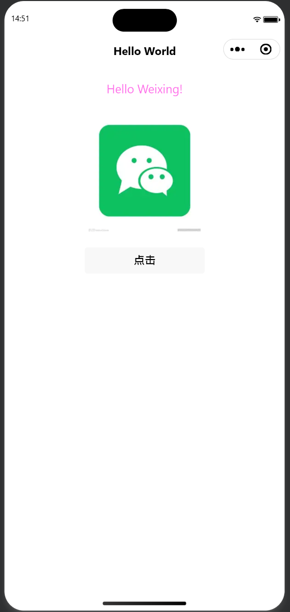
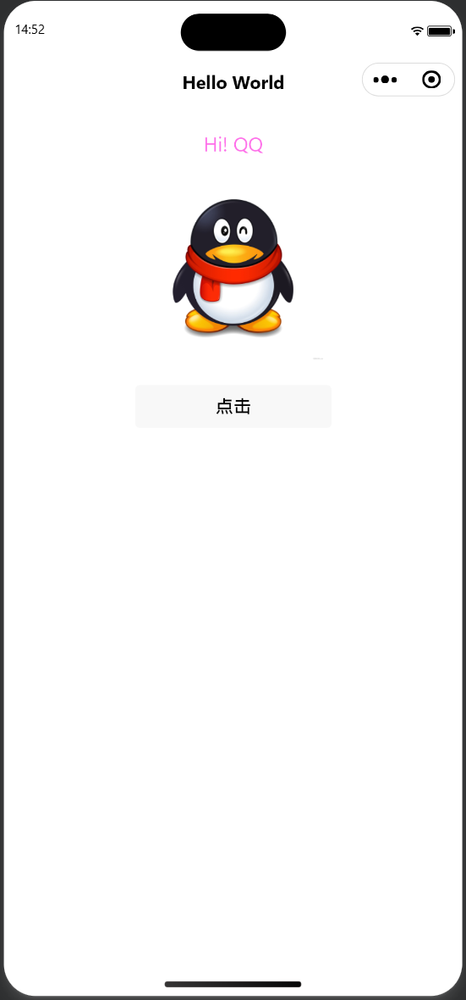

<center>

# 实验1：热身运动——第一个微信小程序

**姓名：彭湘莲　学号：24020007096**

</center>

| 项目     | 内容                                                          |
| -------- | ------------------------------------------------------------- |
| 课程     | 中国海洋大学26夏《移动软件开发》                               |
| 实验名称 | 实验1：热身运动——第一个微信小程序                             |
| 代码仓库 | [https://github.com/xianglian/mobile-dev-labs](https://github.com/xianglian/mobile-dev-labs) |
| 博客链接 | [https://xianglian.github.io](https://xianglian.github.io)     |

---

## 一、实验内容

### 1. 熟悉开发工具和开发框架

安装微信开发者工具，新建空项目（不使用模板），认识小程序项目结构：

| 文件/目录                                | 作用                                                                                       |
| ---------------------------------------- | ------------------------------------------------------------------------------------------ |
| `app.json` / `app.js` / `app.wxss` | 全局配置 / 全局逻辑 / 全局样式                                                             |
| `pages/index/`                         | 首页，四个同名文件组成：`wxml` 结构、`wxss` 样式、`js` 数据与逻辑、`json` 页面配置 |
| `components`                           | 自定义导航栏组件                                                                           |
| `img/`                                 | 图片资源目录                                                                               |

认识所用到的组件：`view`（容器）、`text`（文本）、`image`（图片）、`button`（按钮）、`navigation-bar`（导航栏）。

### 2. 具体代码和呈现效果

功能：**点击按钮，文字与图片同步切换**——`Hello World!`↔`Hi!`，微信图标↔QQ 图标。

```html
<!-- index.wxml -->
<navigation-bar title="Weixin" back="{{false}}" color="black" background="#FFF"></navigation-bar>

<view class="page-container">
  <text class="text">{{ isHello ? 'Hello World!' : 'Hi!' }}</text>
  <image class="hero" mode="widthFix" src="{{ isHello ? '/img/weixing.png' : '/img/QQ.jpeg' }}"></image>
</view>

<button bind:tap="onClick">点击</button>
```

> 说明：`navigation-bar` 为顶部导航栏；`text` 通过 `{{ }}` 数据绑定显示文字，三元表达式按 `isHello` 在 `Hello World!` 和 `Hi!` 间切换；`image` 的 `src` 同样按 `isHello` 在两张图之间切换；`button` 用 `bind:tap="onClick"` 绑定点击事件。

```js
// index.js
Page({
  data: { isHello: true },
  onClick: function () {
    this.setData({ isHello: !this.data.isHello })
  }
})
```

> 说明：`data` 定义页面数据 `isHello`（初始为 `true`）；`onClick` 是按钮点击回调，`setData` 将 `isHello` 取反并通知页面重新渲染——`setData` 是小程序更新界面的唯一方式。

```css
/* index.wxss */
.page-container {
  display: flex;
  flex-direction: column;
  align-items: center;
  padding: 40rpx 0;
}
.text {
  font-size: 32rpx;
  color: #1dbaba;
  margin-bottom: 20px;
}
.hero {
  width: 300rpx;
}
```

> 说明：`.page-container` 用 flex 纵向排列并水平居中；`.text` 设置字号与颜色；`.hero` 设置图片宽度 `300rpx`，高度由 `mode="widthFix"` 按原图比例自适应。

```json
/* index.json */
{ "usingComponents": { "navigation-bar": "/components/navigation-bar/navigation-bar" } }
```

> 说明：`usingComponents` 声明本页面引用了 `navigation-bar` 自定义组件，wxml 中的对应标签才能被识别。

实现原理：用一个布尔状态 `isHello` 同时控制文字和图片的 `src`（`{{ }}` 数据绑定）；按钮触发 `onClick`，用 `setData` 取反状态，界面自动更新。文字与图片共享同一状态，故一次点击即可同步切换。

呈现效果：页面自上而下为导航栏、文字、图片、按钮；每次点击，文字与图片同时切换。

<center>效果图 1：初始状态（微信图标）</center>



<center>效果图 2：点击后（QQ 图标）</center>



## 二、问题总结与体会

### 遇到的问题及解决

1. **图片无法显示**：`img/weixing.png` 后缀虽是 `.png`，真实内容是 WebP 格式（文件头 `RIFF....WEBP`），小程序按 PNG 解码失败。用 Python/PIL 转成真正的 PNG 后正常。
2. **Skyline 渲染器下图片不显示**：`app.json` 启用了 Skyline 渲染器，`image` 未设宽度时尺寸为 0×0，`widthFix` 也撑不开。设固定宽度（`300rpx`）后解决。
3. **按钮被挤出屏幕**：`app.wxss` 全局 `.container` 的 `height:100%` 与页面同名类叠加，内容超高被 Skyline 裁剪。换独立类名 `page-container` 解决。

### 体会

本次实验我从零搭建了微信小程序开发环境，完成了一个"点击按钮切换文字与图片"的页面。过程中我体会到小程序采用数据驱动的开发方式：界面由 `data` 决定，`setData` 改数据即更新界面。另外还踩了几个坑——图片真实格式是 WebP 却伪装成 PNG、全局同名样式冲突把按钮挤出屏幕——让我学会了按控制台报错和文件真实格式来逐层排查问题。

今后我会继续开发学习，逐步掌握更多小程序功能。

---
