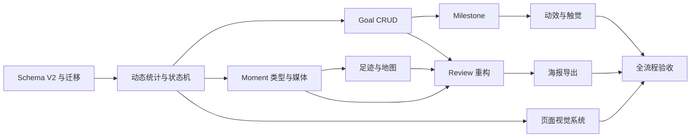

# ongoing_ 项目修复与再设计计划

> 文档状态：方案已进入实现；实际完成情况见 `IMPLEMENTATION_REPAIR_LOG.md`
>
> 创建日期：2026-09-08
>
> 适用项目：原生微信小程序 `project-my summer holiday`
>
> 当前说明：本文件保留设计依据与验收基线；实现记录、关键文件和剩余真机验收项统一维护在修复记录中。

## 1. 项目目标

将当前“可以浏览的交互原型”完善为一个适合课程答辩的完整个人项目。

最终产品定义：

> ongoing_ 是一款本地优先的个人生活章节记录工具。用户用 Moment 收藏照片、文字、声音、地点和目标进展，并在 Chapter 结束时得到一份可回看、可分享的故事回望。

项目完成后需要同时满足三个条件：

1. 功能真实：所有可点击入口都有结果，数据可以长期保存。
2. 体验闭环：用户能够独立完成“创建 Chapter -> 记录 Moment -> 完成 Goal -> 生成 Review”。
3. 展示出彩：答辩者在 90 秒内可以展示至少三个有记忆点的交互。

## 2. 设计判断

- 改造模式：保留品牌的定向升级，不推倒重做。
- 保留内容：`ongoing_ / 未完`、Chapter、Moment、Review、纸本叙事、橄榄绿、摄影主导。
- 需要重构：数据统计、状态逻辑、编辑流程、足迹、目标、回望输出、视觉规范。
- `DESIGN_VARIANCE`：5/10。适度错落，不做实验性排版。
- `MOTION_INTENSITY`：4/10。明显有反馈，但不做滚动炫技。
- `VISUAL_DENSITY`：5/10。日常使用清楚，回望页面适当留白。
- 主题策略：最终课程版使用统一的浅色纸本主题。深色模式不进入本轮范围。

## 3. 可选的视觉方向

### 方案 A：安静的生活档案

关键词：克制、编辑感、纸本、摄影、留白。

表现方式：

- 大图和清晰文字层级为主。
- 页面转场轻微淡入和位移。
- 回望像一本排版精致的小型杂志。
- 交互隐藏在细节中，不主动炫耀。

优点：与现有品牌最匹配，开发风险低，容易保持统一。

缺点：如果只做静态排版，答辩时可能显得不够亮眼。

### 方案 B：夏日手账拼贴

关键词：贴纸、拍立得、手写、旋转照片、彩色纸片。

表现方式：

- 页面加入胶带、邮戳、手写批注和错落相片。
- Moment 使用拼贴卡片。
- Review 像一本可翻动的旅行手账。

优点：第一眼强烈，适合“暑假”主题。

缺点：容易显得装饰过度，也会把产品限制为旅行或夏日主题。不同 Chapter 很难长期复用。

### 方案 C：沉浸式时光胶片

关键词：电影感、大图、章节转场、时间轴、情绪色。

表现方式：

- Chapter 封面进入时有轻微景深缩放。
- Moment 时间线像胶片一样连续展开。
- Review 使用全屏影像、地点路径和回忆片段。
- 完成 Chapter 时有明确的“封存”仪式。

优点：展示效果最强，能让项目具有作品感。

缺点：动效和图片管理工作量较高，控制不好会影响性能和阅读。

### 最终推荐：A 为基础，加入 C 的三个关键时刻

不采用整套手账拼贴，也不把每个页面都做成动画页面。整个应用保持安静、清楚，只在以下三个时刻加强表现：

1. 打开 Chapter：封面轻微缩放，标题和真实统计依次出现。
2. 完成 Goal：勾选反馈、轻振动、生成一条 Milestone Moment。
3. 完成 Chapter：内容收束为 Review，生成可以保存的回望海报。

这三个交互共同表达一个产品逻辑：生活被记录，记录产生进展，进展最终成为故事。

## 4. 核心展示亮点

### HIGHLIGHT-01：今日回声

在首页最新 Moment 下方增加“今日回声”。仅在存在历史数据时出现，从过去的同一天、同一地点或同一标签中选出一条记录。

展示内容：

- 一张照片。
- “去年今天”或“又来到这里”。
- 一句原始记录。
- 点击进入 Moment 详情。

价值：让应用不只是记录工具，也能主动把生活还给用户。

降级规则：没有合适历史记录时整个区块不渲染，不使用虚构数据占位。

### HIGHLIGHT-02：有反馈的快速记录

中央加号继续保留，底部面板从五个相同入口改成四个真实入口：

- 照片
- 文字
- 语音
- 地点

“记录进展”移动到 Goal 内部，由具体目标发起，避免它与普通 Moment 重复。

交互规则：

- 面板打开时间 220ms，背景渐暗。
- 点击入口提供一次轻振动。
- 照片入口直接调用相机或相册。
- 文字入口自动聚焦输入框。
- 语音入口直接显示录音状态。
- 地点入口先解释用途，再申请定位权限。

### HIGHLIGHT-03：Milestone 生成

用户完成 Goal 后：

1. 复选框产生 180ms 缩放反馈。
2. 手机轻振动一次。
3. 出现小型金色圆环扩散，持续不超过 400ms。
4. 询问是否将这次完成记录为 Moment。
5. 自动带入 Goal 名称、完成时间和 `里程碑` 标签。

禁止使用满屏彩纸、长时间动画或无法关闭的庆祝效果。

### HIGHLIGHT-04：真实足迹

足迹模块只保留一个标签。内部提供两种视图：

- 地点卡片：适合作为默认视图，按首次出现时间排列。
- 地图视图：在真实经纬度存在时显示 Marker。

地图没有足够坐标时，不绘制假的路线。此时使用地点照片、记录次数和时间范围表达足迹。

### HIGHLIGHT-05：Chapter 封存仪式

完成 Chapter 时使用两步流程：

1. 写下一句结语。
2. 预览 Review 并确认“完成这一章”。

确认后：

- 状态更新为 `COMPLETED`。
- 封面上的“正在发生”变为“已成章”。
- 页面从编辑状态过渡到回望状态。
- 提供“保存回望海报”和“分享给朋友”两个不同意图的操作。

### HIGHLIGHT-06：回望海报

使用 Canvas 生成真实图片，不能只调用微信页面分享。

海报内容：

- Chapter 封面。
- Chapter 名称和日期。
- 真实天数、Moment 数、地点数、Goal 完成数。
- 3 张代表照片。
- 用户结语。
- `ongoing_` 品牌签名。

输出至少支持 3:4 单页海报。长图故事版可以作为后续增强，不作为第一版必需项。

## 5. 页面重新设计

### 5.1 首页“当下”

目标：五秒内让用户知道当前 Chapter、今天能做什么、最近记录了什么。

```text
┌ ongoing_                 搜索  头像 ┐
│ 9月8日，晚上好                         │
│                                        │
│ [ 当前 Chapter 封面 ]                  │
│ 大二暑假                  正在发生      │
│ 已记录 38 天              16 个 Moment │
│                                        │
│ 今天想留下什么                         │
│ [照片] [文字] [语音] [地点]            │
│                                        │
│ 最新 Moment                            │
│ [照片][日期、内容、地点]                │
│ [照片][日期、内容、地点]                │
│                                        │
│ 今日回声                               │
│ [一年前或相关历史 Moment]              │
└ 当下              ＋              回望 ┘
```

调整项：

- 移除左右两组诗意小字，避免首页首屏信息竞争。
- Chapter 卡只保留一个标题、一个状态、一句描述和真实统计。
- 快捷入口保留四个，不在首页展示“进展”。
- 最新 Moment 最多显示 2 条，保证“今日回声”有机会进入首屏后的第二屏。
- 当前没有 Chapter 时，用一个明确空状态引导创建，不显示无效快捷入口。

### 5.2 Chapter 详情

目标：表达这段生活的进展，并成为所有内容的中枢。

结构：

1. 封面与标题。
2. 动态统计：已记录天数、Moment、地点、Goal。
3. 四个固定标签：瞬间、足迹、目标、回望。
4. 当前标签内容。
5. 页面级主要操作。

交互：

- 封面加载后从 `scale(1.02)` 回到 `scale(1)`，时间 500ms。
- 标题和统计分两组淡入，总时长不超过 450ms。
- 标签切换只做 180ms 的透明度过渡。
- 已完成或归档 Chapter 不允许直接添加 Moment，需要先恢复为进行中。

### 5.3 Moment 编辑器

目标：用户在十秒内可以留下最小记录。

第一屏只出现：

- 类型切换。
- 主输入区域。
- 当前 Chapter。
- 固定在底部的保存按钮。

心情、标签和时间收进“补充信息”折叠区。地点或语音已经作为主类型选择时，自动展开对应输入。

保存条件按类型变化：

| 类型 | 最低保存条件 |
|---|---|
| 照片 | 至少一张图片 |
| 文字 | 至少一个非空字符 |
| 语音 | 至少一段成功保存的录音 |
| 地点 | 至少一个地点 |
| Milestone | Goal ID 和进展状态 |

### 5.4 Goal 页面区块

目标：让用户创建的 Chapter 也能使用目标功能。

功能：

- 新增、编辑、删除 Goal。
- 未完成和已完成分组。
- 支持排序。
- 点击整行查看详情，点击复选框快速完成。
- 完成后可以生成 Milestone Moment。

空状态文案：

> 写下一件想在这一章完成的事。

操作：`添加第一个目标`

### 5.5 足迹

默认采用地点卡片，不用抽象的圆点和假路线。

每个地点卡展示：

- 地点名称。
- 第一张真实照片。
- Moment 数量。
- 第一次和最近一次到访时间。

点击地点进入筛选结果页或地点详情层，显示该地点的全部 Moment。

### 5.6 回望

目标：成为整个项目的展示高潮。

建议章节顺序：

1. 封面：标题、日期、结语、真实统计。
2. 开始：第一条 Moment。
3. 片段：代表照片胶片带。
4. 足迹：真实地点与记录。
5. 情绪：心情和标签摘要。
6. 完成：Goal 和 Milestone。
7. 结尾：用户结语、保存海报、分享。

移除内容：

- 每节重复的 `01 / 02 / 03` 编号。
- 每节重复的全大写英文眉题。
- 假路线和固定圆点装饰。
- 与数据无关的进度图形。

### 5.7 回望 Gallery

- 状态切换继续使用“正在发生、已成章、已归档”。
- 卡片数字全部从真实数据计算。
- 每种状态提供不同空状态说明。
- 长按卡片打开状态相关操作，点击仍进入详情。
- 新建按钮保持在页面顶部，不增加第二个重复的新建按钮。

### 5.8 搜索

- 初始状态显示最近搜索和建议标签。
- 搜索结果分为 Chapter、Moment、地点三类。
- 输入后延迟 150ms 再查询，避免每个字符重复更新。
- 高亮命中的文字、标签或地点。
- 无结果时提供“创建一个 Moment”，前提是存在进行中的 Chapter。

### 5.9 我的

保留：

- 编辑头像、昵称和简介。
- 私密记录开关。
- 图片质量设置。
- 数据概览。
- 重看引导。
- 恢复示例数据。

本轮移除：

- 没有实现的数据与备份入口。
- 没有实现的主题入口。
- 所有只弹出“仍在继续书写”的控件。

## 6. 视觉系统

### 6.1 色彩

应用只使用一个品牌强调色。Chapter 可以有封面主色，但不能改变按钮和导航的品牌色。

| Token | 建议值 | 用途 |
|---|---|---|
| `--color-bg` | `#F7F5EF` | 页面背景 |
| `--color-surface` | `#FFFDF8` | 卡片和输入面 |
| `--color-text` | `#253029` | 主文字 |
| `--color-text-secondary` | `#626C65` | 辅助文字 |
| `--color-text-muted` | `#747C76` | 最弱可读文字 |
| `--color-brand` | `#4F6A58` | 主按钮和选中态 |
| `--color-brand-soft` | `#E2EAE3` | 品牌浅背景 |
| `--color-highlight` | `#C79A4B` | Milestone 少量强调 |
| `--color-danger` | `#A95345` | 删除和错误 |
| `--color-line` | `rgba(37,48,41,.12)` | 分隔线 |

要求：普通正文和背景对比度至少 4.5:1。图片上的文字必须有稳定遮罩，不能依赖图片本身的明暗。

### 6.2 字体

- 品牌名称：Georgia，仅用于英文品牌 `ongoing_`。
- 中文标题与正文：系统无衬线字体。
- 回望引语：`Songti SC`，仅用于完整句子和结语。
- 楷体：最多保留一个封面手写批注位置。
- 页面内不要同时出现黑体、宋体、楷体三种中文字体。

字号建议：

| 层级 | 字号 |
|---|---|
| 页面主标题 | 40-44rpx |
| 区块标题 | 30-34rpx |
| 正文 | 26-28rpx |
| 辅助文字 | 22-24rpx |
| 极少量元数据 | 20rpx，且必须达到足够对比度 |

### 6.3 圆角与间距

圆角：

- 页面卡片：24rpx。
- 输入框、小型容器：16rpx。
- 图片内层：16rpx。
- 主按钮：全圆角。
- 图标按钮：圆形。

间距只使用：16、24、32、48、64rpx。特殊大图区域可以例外，但需要在组件内说明。

### 6.4 图标

- 使用现有同一套线性图标并统一线宽。
- 不混用文本符号、Emoji 和 SVG 表达同一种功能。
- `⌖`、`●`、`◐`、`✦` 等字符逐步替换为统一图标或纯文字状态。
- 收藏、分享、更多等图标按钮必须有无障碍名称。

## 7. 动效与触觉规则

动效只服务于四个目的：进入层级、操作反馈、状态改变、故事收束。

| 场景 | 动效 | 时间 |
|---|---|---|
| 页面进入 | 透明度与 8rpx 纵向位移 | 240-320ms |
| 按钮按下 | `scale(.98)` | 100-140ms |
| 底部记录面板 | 从底部进入，背景渐暗 | 220ms |
| 标签切换 | 内容透明度切换 | 180ms |
| Goal 完成 | 勾选缩放和金色圆环 | 300-400ms |
| Chapter 封面 | `scale(1.02)` 到 `scale(1)` | 500ms |
| Review 照片 | 进入视口后轻微淡入 | 260ms |

触觉反馈：

- 打开快速记录：轻振动一次。
- 录音开始和结束：各一次轻振动。
- 收藏成功：轻振动一次。
- Goal 完成：轻振动一次。
- 删除、普通导航和滚动不振动。

所有动效必须允许在系统减少动态效果时退化为静态状态。

## 8. 功能修复清单

### P0：开发开始后首先完成

- [ ] `DATA-01` 建立 Schema V2 和数据迁移，不因版本变化覆盖用户记录。
- [ ] `DATA-02` Moment 增加真实 `type` 字段。
- [ ] `DATA-03` Moment 图片由单值升级为 `media[]`，同时兼容旧 `image` 字段。
- [ ] `DATA-04` 用户设置写入统一 Store。
- [ ] `DATA-05` 统计数据改为 selector 动态计算。
- [ ] `DATA-06` 删除或替换媒体时清理本地持久文件。
- [ ] `DATA-07` 修正示例 Chapter 与 Moment 的关联数据。
- [ ] `DATE-01` 动态计算已记录天数、总天数和日期进度。
- [ ] `DATE-02` 验证结束日期不能早于开始日期。
- [ ] `DATE-03` 新建 Moment 的日期格式与示例数据保持一致，包含星期。
- [ ] `STATE-01` 明确 `ONGOING`、`COMPLETED`、`ARCHIVED` 的合法转换。
- [ ] `STATE-02` 已完成和已归档 Chapter 禁止直接新增 Moment。
- [ ] `GOAL-01` 完成 Goal 的新增、编辑、删除、排序和切换。
- [ ] `GOAL-02` Milestone Moment 能关联 `goalId`。
- [ ] `ERROR-01` Chapter、Moment 和 Review 无效 ID 显示错误页并提供返回操作。
- [ ] `ERROR-02` 处理媒体取消、权限拒绝、录音中断和本地存储失败。
- [ ] `SETTINGS-01` 私密记录和图片质量设置真正持久化并影响保存行为。
- [ ] `UI-01` 移除所有无效入口和“尚未完成”提示。

### P1：形成作品记忆点

- [ ] `UX-01` 重构快速记录面板和四种真实编辑模式。
- [ ] `UX-02` Moment 编辑器增加固定保存区和补充信息折叠区。
- [ ] `UX-03` Goal 完成反馈和 Milestone 生成。
- [ ] `UX-04` Chapter 进入动效和动态统计。
- [ ] `FOOTPRINT-01` 地点卡片视图。
- [ ] `FOOTPRINT-02` 有真实坐标时显示地图 Marker。
- [ ] `REVIEW-01` 回望内容全部使用真实统计和真实照片。
- [ ] `REVIEW-02` Canvas 生成 3:4 回望海报。
- [ ] `MEMORY-01` 首页“今日回声”。
- [ ] `VISUAL-01` 统一色彩、字体、间距、圆角和图标。
- [ ] `VISUAL-02` 启用并重新分配现有图片，消除三张图重复使用的问题。
- [ ] `A11Y-01` 正文、辅助文字、按钮和图片遮罩满足可读性要求。
- [ ] `A11Y-02` 主要点击区域不小于约 88rpx。

### P2：时间充足时增加

- [ ] `SEARCH-01` 最近搜索、结果高亮和地点结果。
- [ ] `MEDIA-01` 多图排序和图片预览分页。
- [ ] `PROFILE-01` 头像、昵称和简介编辑。
- [ ] `EXPORT-01` 长图版 Review。
- [ ] `POLISH-01` 关键操作轻触觉反馈。

### 本轮明确不做

- [ ] 微信账号体系。
- [ ] 云数据库和跨设备同步。
- [ ] Shared Chapter。
- [ ] AI 自动生成文案。
- [ ] 多人权限和共同时间线。
- [ ] 复杂路线规划。

这些能力只进入答辩 Roadmap，不出现在当前可点击界面中。

## 9. 数据模型目标

```text
AppState
├── schemaVersion
├── activeChapterId
├── chapters[]
├── moments[]
├── goals[]
├── profile
└── settings

Chapter 1 -> N Moment
Chapter 1 -> N Goal
Goal    1 -> N Milestone Moment
Moment  0 -> 1 Place
Moment  1 -> N Media
```

派生字段不能持久化为事实来源：

- `momentCount`
- `placeCount`
- `goalsDone`
- `progress`
- `dayCurrent`

这些字段在页面加载时通过 selector 计算。这样首页、Chapter、Gallery、Profile 和 Review 会天然一致。

## 10. 开发依赖顺序



不能先重画全部页面再修数据。Review、统计、足迹和 Goal 都依赖新的数据模型。

## 11. 建议开发节奏

### 第 1 天：基础修复

- Schema V2。
- 示例数据修正。
- 动态统计。
- 日期和状态机。
- 无效 ID 和错误状态。

### 第 2 天：核心闭环

- Goal CRUD。
- Moment 类型。
- 编辑器保存条件。
- 权限和媒体异常。

### 第 3 天：页面体验

- 首页。
- Chapter 详情。
- Moment 编辑器。
- Gallery、搜索和我的。

### 第 4 天：展示高潮

- 足迹。
- Milestone。
- Review。
- 回望海报。

### 第 5 天：视觉统一与验收

- 全局视觉 Token。
- 图片分配。
- 动效和触觉。
- 320、360、390px 检查。
- Android 和 iPhone 真机检查。
- 录制答辩演示。

## 12. 验收用例

### 主流程

- [ ] 首次进入可以完成或跳过引导。
- [ ] 可以创建一个不依赖示例数据的新 Chapter。
- [ ] 可以添加三个 Goal。
- [ ] 可以分别创建照片、文字、语音和地点 Moment。
- [ ] 完成 Goal 后可以生成 Milestone。
- [ ] 所有页面显示的统计数字一致。
- [ ] 完成 Chapter 后自动从“正在发生”进入“已成章”。
- [ ] Review 能正确展示第一条、最后一条、代表照片、地点、情绪和目标。
- [ ] 回望海报可以保存到相册。
- [ ] 重启小程序后记录、设置和状态仍然存在。

### 异常流程

- [ ] 用户拒绝位置权限后可以继续记录其他内容。
- [ ] 用户取消相册选择后页面保持可用。
- [ ] 录音被电话或系统中断后有明确提示。
- [ ] 存储空间不足时不显示保存成功。
- [ ] 删除 Moment 后图片文件和统计同步更新。
- [ ] 删除 Chapter 后相关 Moment、Goal 和媒体同步处理。
- [ ] 无效分享链接不会显示空白页。
- [ ] 已完成 Chapter 不能在状态不明确的情况下新增 Moment。

### 视觉与设备

- [ ] 320px 宽度没有横向溢出和按钮文字截断。
- [ ] 390px 宽度首屏层级清楚。
- [ ] Android 字体回退后标题和正文仍然稳定。
- [ ] 顶部胶囊、状态栏和底部安全区无遮挡。
- [ ] 正文不低于 26rpx，辅助文字通常不低于 22rpx。
- [ ] 可点击区域不小于约 88rpx。
- [ ] 动效关闭后所有功能仍可使用。

## 13. 答辩演示脚本

目标时长：90 秒。

1. 进入首页，用一句话介绍 Chapter、Moment、Review。
2. 新建“我的暑假”Chapter，并添加三个 Goal。
3. 通过中央加号拍照并标记地点。
4. 完成一个 Goal，展示 Milestone 反馈。
5. 进入足迹，查看真实地点和相关 Moment。
6. 完成 Chapter，写下结语。
7. 打开 Review，展示照片、足迹、情绪和目标。
8. 生成并保存回望海报。

答辩叙述重点：

- 产品结构清楚，不是普通相册或备忘录。
- 数据模型支持 Chapter、Moment、Goal 和 Place 的关系。
- 所有统计从真实记录计算。
- 本地优先保证课程演示稳定。
- 云同步和共同 Chapter 有明确扩展边界，但没有混入当前半成品。

## 14. 开发完成定义

只有同时满足以下条件，项目才可以标记为完成：

1. P0 全部完成。
2. P1 中 `REVIEW-02`、`GOAL-02`、`VISUAL-01` 必须完成。
3. 没有无效按钮和假数据统计。
4. 新用户不依赖示例内容也能走完整流程。
5. JavaScript、JSON、WXML 和 WXSS 编译通过。
6. 至少完成一次 Android 和一次 iPhone 真机主流程。
7. 90 秒答辩脚本可以连续完成，无需重启或人工修改数据。
